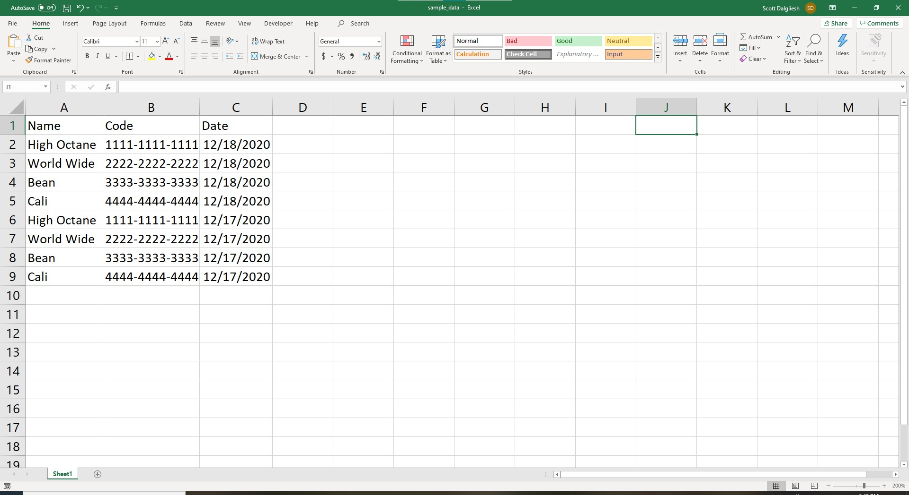
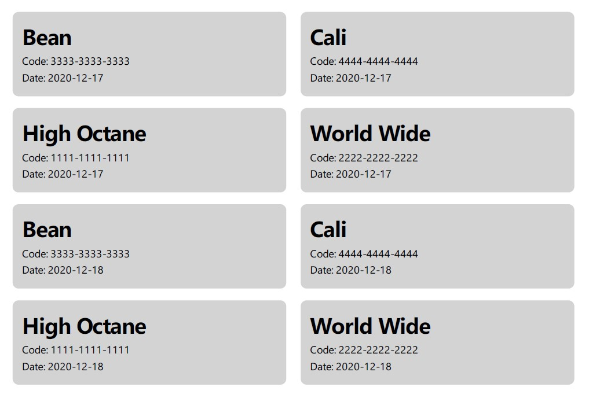

# labelit
Python command-line tool for generating html-based labels from data provided in excel spreadsheet format

## Basic Usage
Open the command prompt and navigate to the directory containing the input excel file. The following example assumes the excel input file is titled 'input_data.xlsx' and input data is located in 'Sheet1". Input data format as shown in [Input Format](#Input-Format). Generated labels are saved to 'labels.pdf'.
``` bat
> labelit
File generated: labels.pdf
```

## Options
The following example illustrates how to specify other (excel) input file names, sheet names, output pdf file names and enabling the output of the HTML code for inspection.

``` bat
> labelit -i other_input_file.xlsx -s other_sheet -o other_labels.pdf --output-html
File generated: other_labels.pdf
File generated: other_labels.html
```

## Input Format
The following demonstrates the excel input file data format required.



## Sample Output
The following output was generated using the sample data shown in [Input Format](#Input-Format).



## Dependencies
click - command line interface\
openpyxl - data import from excel\
jinja2 - html templating\
pdfkit - python api for wkhtmltopdf\
wkhtmltopdf - conversion of html document to printable pdf ([link](https://wkhtmltopdf.org/downloads.html))

## License
[MIT](LICENSE)